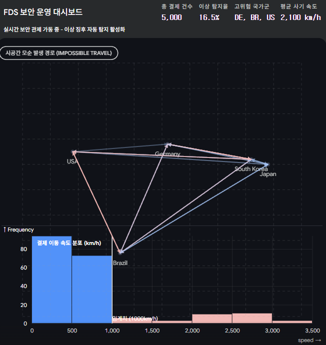

FDS (Fraud Detection System) Data Pipeline
**해외 결제 이상 거래 탐지를 위한 시공간 기반 데이터 마트 및 자동화 파이프라인 구축**

<br>

## 📌 Project Overview
본 프로젝트는 글로벌 카드 결제 서비스에서 발생하는 **이상 거래(Fraud)**를 사전에 탐지하기 위해 구축된 데이터 파이프라인입니다. 단순한 결제액 집계를 넘어, 시계열 데이터와 위경도 데이터를 결합하여 **'물리적으로 불가능한 이동(Impossible Travel)'**을 찾아내는 고도화된 비즈니스 룰을 데이터 웨어하우스 단에서 구현했습니다.

* **기여도:** 100% (개인 프로젝트)
* **주요 스택:** Python, Apache Airflow, dbt(data build tool), SQL
* **목적:** 보안/리스크팀이 즉각적으로 활용 가능한 고품질의 FDS 데이터 마트 제공

<br>

## 🏗️ Architecture & Data Flow
 


1. **Data Generation:** `Python Faker`를 활용해 일일 5,000건의 비즈니스 룰(국내 80/해외 20)이 반영된 가상 결제 로그 데이터 생성
2. **Orchestration:** `Apache Airflow`를 이용해 일일 배치(Daily Batch) 파이프라인 구축 및 내결함성(Fault Tolerance) 확보
3. **Transformation:** `dbt`를 도입하여 Staging - Intermediate - Marts 3계층으로 데이터 모델링 및 품질 테스트 자동화

<br>

## 💡 Key Engineering Challenges & Solutions

### 1. `LAG` 윈도우 함수를 활용한 '시공간 모순(Impossible Travel)' 탐지
* **문제:** 서울에서 결제한 지 30분 만에 뉴욕에서 결제가 발생하는 도용 케이스를 찾아야 함. 수백만 건의 데이터를 루프(Loop)로 탐색하는 것은 비효율적.
* **해결:** dbt Intermediate 계층에서 SQL `LAG()` 함수를 사용하여 현재 결제 건에 '직전 결제 시간 및 국가'를 결합. 두 결제 간의 시간 차이(분 단위)와 국가 변경 여부를 계산하여 즉각적으로 사기 여부(`is_fraud`)를 판별하는 비정규화 테이블 구축.

### 2. Airflow를 통한 파이프라인 멱등성 및 내결함성 확보
* **문제:** 외부 API 통신 지연이나 DB 연결 오류 등 일시적 장애(Transient Error)로 인한 파이프라인 중단 방지 필요.
* **해결:** `retries=2`, `retry_delay=5m` 속성을 부여하여 실패한 Task부터 자동으로 재시작하도록 구성. `catchup=False`를 적용하여 스케줄러 지연 시 데이터 중복 적재(Fan-out) 방지.

### 3. dbt Test를 통한 무결성 보장
* **해결:** `schema.yml`을 구성하여 원본 및 마트 테이블의 주요 컬럼(`trx_id`, `amount`)에 대해 `not_null` 및 `unique` 테스트를 강제. 테스트 실패 시 후속 작업이 중단되도록 하여 오염된 데이터의 서빙을 원천 차단.

<br>

## 📂 Repository Structure
```text
📦 FDS-Fraud-Detection-Pipeline
 ┣ 📂 dags/                   # Airflow 스케줄링 파일 (fds_daily_pipeline.py)
 ┣ 📂 data_generator/         # Python Faker 기반 데이터 생성 모듈
 ┣ 📂 dbt_fds_marts/          # dbt SQL 모델링 (Staging, Intermediate, Marts)
 ┣ 📂 docs/                   # 다이어그램 및 에셋
 ┗ 📜 README.md